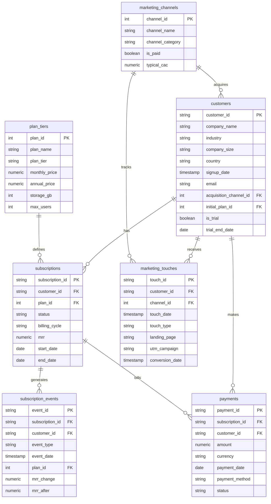
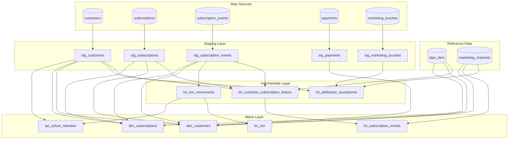
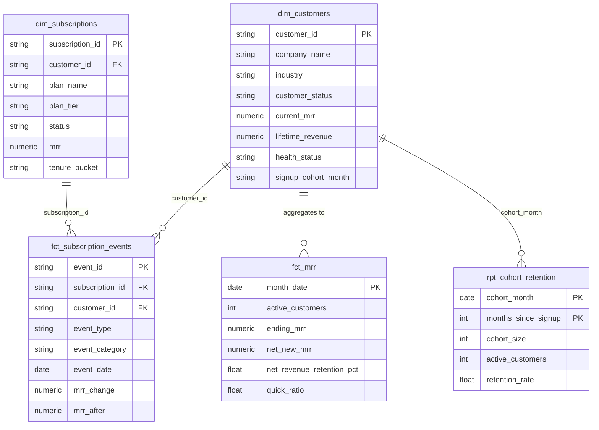

# Schema Diagram

## Entity Relationship Diagram

```mermaid
erDiagram
    customers ||--o{ subscriptions : "has"
    customers ||--o{ payments : "makes"
    customers ||--o{ marketing_touches : "receives"
    subscriptions ||--o{ subscription_events : "generates"
    subscriptions ||--o{ payments : "bills"
    plan_tiers ||--o{ subscriptions : "defines"
    marketing_channels ||--o{ marketing_touches : "tracks"
    marketing_channels ||--o{ customers : "acquires"

    customers {
        string customer_id PK
        string company_name
        string industry
        string company_size
        string country
        timestamp signup_date
        string email
        int acquisition_channel_id FK
        int initial_plan_id FK
        boolean is_trial
        date trial_end_date
    }

    subscriptions {
        string subscription_id PK
        string customer_id FK
        int plan_id FK
        string status
        string billing_cycle
        numeric mrr
        date start_date
        date end_date
    }

    subscription_events {
        string event_id PK
        string subscription_id FK
        string customer_id FK
        string event_type
        timestamp event_date
        int plan_id FK
        numeric mrr_change
        numeric mrr_after
    }

    payments {
        string payment_id PK
        string subscription_id FK
        string customer_id FK
        numeric amount
        string currency
        date payment_date
        string payment_method
        string status
    }

    marketing_touches {
        string touch_id PK
        string customer_id FK
        int channel_id FK
        timestamp touch_date
        string touch_type
        string landing_page
        string utm_campaign
        timestamp conversion_date
    }

    plan_tiers {
        int plan_id PK
        string plan_name
        string plan_tier
        numeric monthly_price
        numeric annual_price
        int storage_gb
        int max_users
    }

    marketing_channels {
        int channel_id PK
        string channel_name
        string channel_category
        boolean is_paid
        numeric typical_cac
    }
```

## Data Model Layers

```mermaid
flowchart TB
    subgraph Sources["Raw Sources"]
        customers[(customers)]
        subscriptions[(subscriptions)]
        events[(subscription_events)]
        payments[(payments)]
        touches[(marketing_touches)]
    end

    subgraph Seeds["Reference Data"]
        plans[(plan_tiers)]
        channels[(marketing_channels)]
    end

    subgraph Staging["Staging Layer"]
        stg_cust[stg_customers]
        stg_sub[stg_subscriptions]
        stg_evt[stg_subscription_events]
        stg_pay[stg_payments]
        stg_touch[stg_marketing_touches]
    end

    subgraph Intermediate["Intermediate Layer"]
        int_hist[int_customer_subscription_history]
        int_mrr[int_mrr_movements]
        int_attr[int_attribution_touchpoints]
    end

    subgraph Marts["Marts Layer"]
        fct_mrr[fct_mrr]
        fct_evt[fct_subscription_events]
        dim_cust[dim_customers]
        dim_sub[dim_subscriptions]
        rpt_coh[rpt_cohort_retention]
    end

    customers --> stg_cust
    subscriptions --> stg_sub
    events --> stg_evt
    payments --> stg_pay
    touches --> stg_touch

    stg_cust --> int_hist
    stg_sub --> int_hist
    stg_evt --> int_hist
    plans --> int_hist

    stg_evt --> int_mrr

    stg_touch --> int_attr
    channels --> int_attr
    stg_cust --> int_attr

    int_mrr --> fct_mrr
    int_hist --> fct_evt
    channels --> fct_evt

    stg_cust --> dim_cust
    stg_sub --> dim_cust
    stg_evt --> dim_cust
    stg_pay --> dim_cust
    channels --> dim_cust
    plans --> dim_cust

    stg_sub --> dim_sub
    stg_cust --> dim_sub
    plans --> dim_sub
    stg_evt --> dim_sub

    int_mrr --> rpt_coh
    stg_cust --> rpt_coh
```

## Fact & Dimension Model

```mermaid
erDiagram
    dim_customers ||--o{ fct_subscription_events : "customer_id"
    dim_customers ||--o{ fct_mrr : "aggregates to"
    dim_subscriptions ||--o{ fct_subscription_events : "subscription_id"
    dim_customers ||--o{ rpt_cohort_retention : "cohort_month"

    dim_customers {
        string customer_id PK
        string company_name
        string industry
        string customer_status
        numeric current_mrr
        numeric lifetime_revenue
        string health_status
        string signup_cohort_month
    }

    dim_subscriptions {
        string subscription_id PK
        string customer_id FK
        string plan_name
        string plan_tier
        string status
        numeric mrr
        string tenure_bucket
    }

    fct_subscription_events {
        string event_id PK
        string subscription_id FK
        string customer_id FK
        string event_type
        string event_category
        date event_date
        numeric mrr_change
        numeric mrr_after
    }

    fct_mrr {
        date month_date PK
        int active_customers
        numeric ending_mrr
        numeric net_new_mrr
        float net_revenue_retention_pct
        float quick_ratio
    }

    rpt_cohort_retention {
        date cohort_month PK
        int months_since_signup PK
        int cohort_size
        int active_customers
        float retention_rate
    }
```
