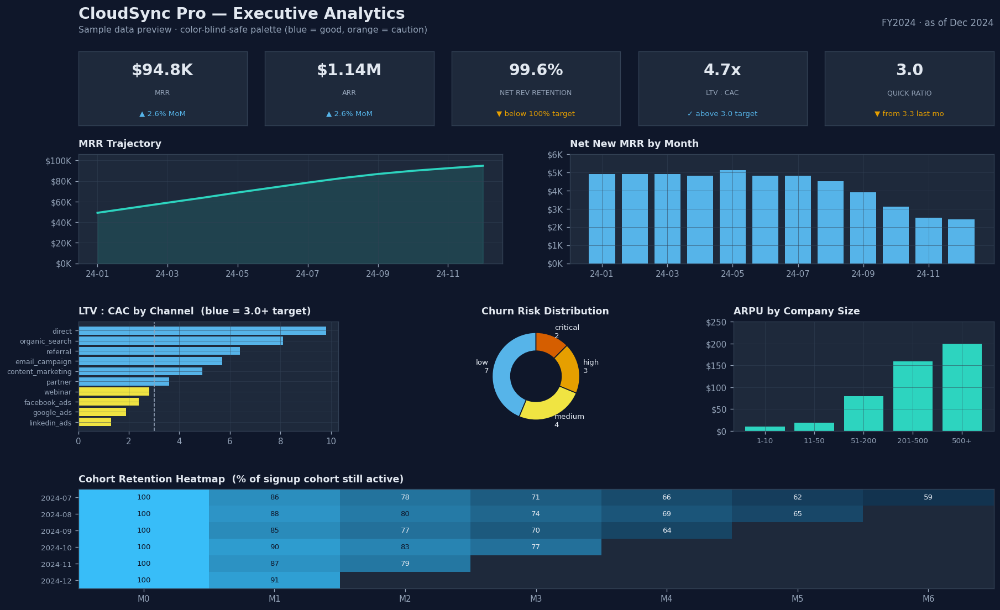
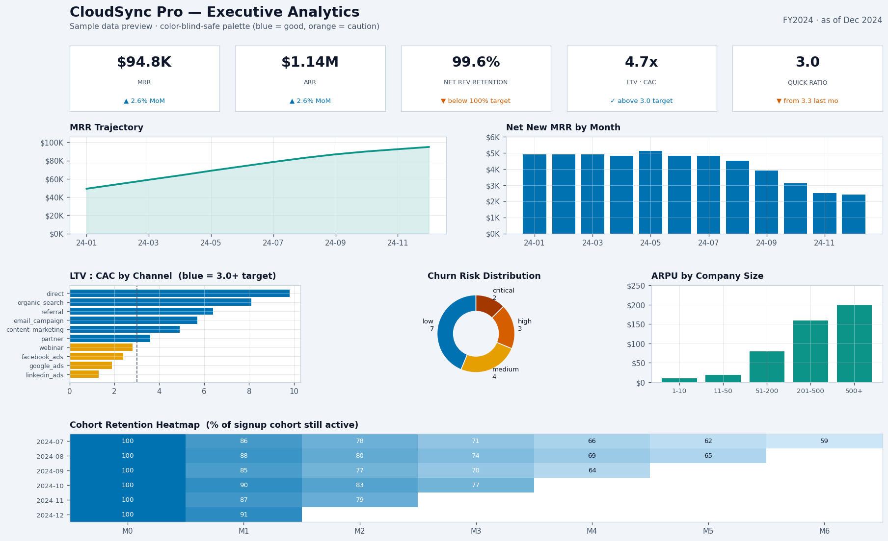
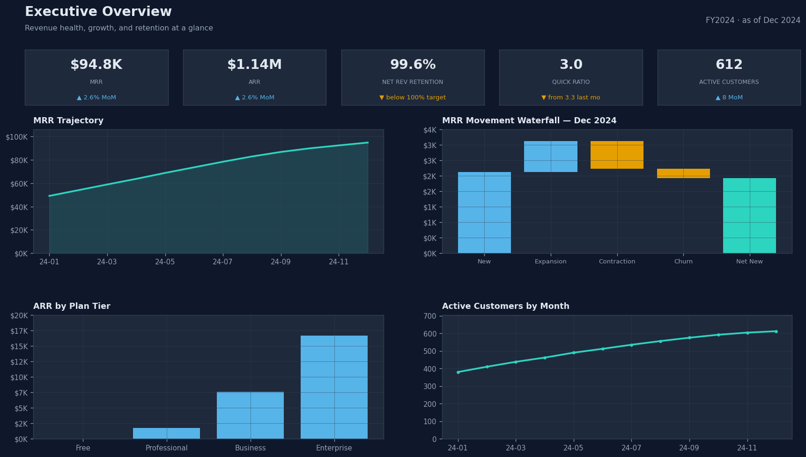
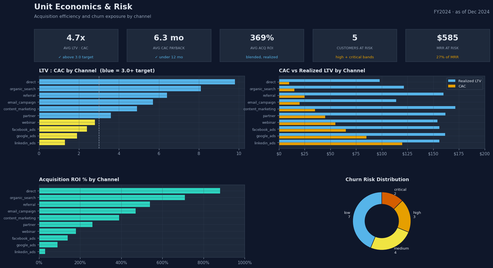
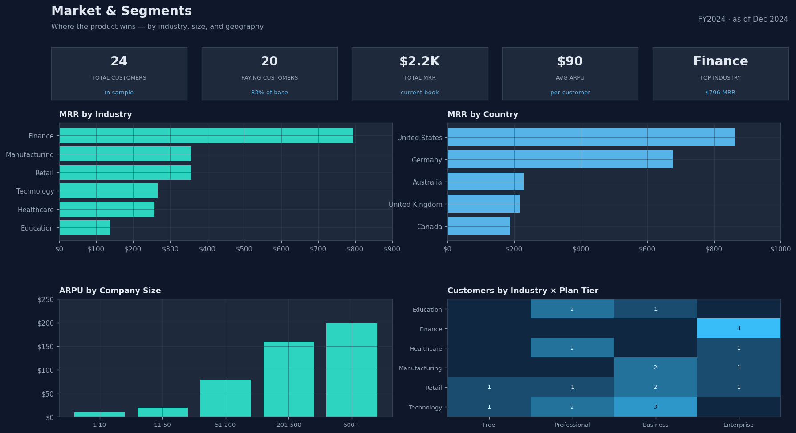

# Build the report in Power BI — turnkey CSV/Excel path

This is the **reliable** path (no PBIP format). One import, a few drags, done in
~10 minutes. Everything comes from a single workbook, `CloudSyncPro_data.xlsx`.

## What you're building

The whole dashboard in one view — rendered from the actual sample data with the
color-blind-safe palette. Your finished Power BI report will look like this.

**Dark theme**



**Light theme**



*Generated by `CloudSyncPro/make_mockup.py` (re-run to regenerate both).*

---

## Step 1 — Import all tables in one step

1. Open **Power BI Desktop** → blank report.
2. **Home → Get data → Excel workbook** → pick
   [`CloudSyncPro_data.xlsx`](CloudSyncPro_data.xlsx) (in this `powerbi/` folder).
3. In the **Navigator**, tick the box next to **all six** sheets:
   `fct_mrr`, `rpt_unit_economics`, `rpt_churn_risk`, `dim_customers`,
   `dim_subscriptions`, `rpt_cohort_retention`.
4. Click **Load**.

That's all six tables in, already typed (dates are dates, numbers are numbers).

> Prefer raw CSVs? They're in `CloudSyncPro/sample_data/`. Use
> **Get data → Text/CSV** once per file (six imports) instead of step 2–4.

---

## Step 2 — (Optional) relationships

In **Model view**, drag to connect (many-to-one):
- `dim_subscriptions[customer_id]` → `dim_customers[customer_id]`
- `rpt_churn_risk[customer_id]` → `dim_customers[customer_id]`

Not required for the visuals below (each uses one table), but nice to have.

---

## Step 3 — Build the visuals (no measures needed)

Drag the fields onto each visual. For value fields, click the field's dropdown
in the **Visualizations** pane and set the aggregation noted in parentheses.
Each page mockup below shows the target layout (light versions:
[executive](page_executive_light.png) · [unit economics](page_unit_economics_light.png) ·
[market](page_market_light.png)).

### Page: Executive



| Visual | Fields (aggregation) |
|---|---|
| Line chart | Axis `fct_mrr[month_key]`, Y `fct_mrr[ending_mrr]` (Sum) |
| Clustered column | Axis `fct_mrr[month_key]`, Y `fct_mrr[net_new_mrr]` (Sum) |
| Card | `fct_mrr[nrr_pct]` (Average) — last-month value if you add the filter below |
| Card | `fct_mrr[quick_ratio]` (Average) |

> KPI cards: to show the **latest month** instead of an average/total, add a
> visual-level filter on the card: `month_key` **is** `2024-12` (or `month_date`
> → Top 1 by `month_date`). Or add the 5 measures in Step 5.

### Page: Unit Economics & Risk



| Visual | Fields (aggregation) |
|---|---|
| Clustered bar | Axis `rpt_unit_economics[acquisition_channel]`, X `ltv_to_cac_ratio` (Average) |
| Clustered bar | Axis `acquisition_channel`, X `cac_payback_months` (Average) |
| Donut | Legend `rpt_churn_risk[risk_band]`, Values `customer_id` (Count) |
| Card | `rpt_churn_risk[mrr_at_risk]` (Sum) |

### Page: Market & Segments



| Visual | Fields (aggregation) |
|---|---|
| Treemap | Group `dim_customers[industry]`, Values `current_mrr` (Sum) |
| Clustered column | Axis `dim_customers[company_size]`, Y `current_mrr` (Average → ARPU) |
| Clustered bar | Axis `dim_customers[country]`, X `current_mrr` (Sum) |
| Matrix | Rows `rpt_cohort_retention[cohort_month_key]`, Columns `period_label`, Values `retention_rate` (Average) |

---

## Step 4 — Apply the accessible theme

**View → Themes → Browse for themes →** [`theme.json`](theme.json)
(color-blind-safe blue/orange palette).

---

## Step 5 — (Optional) add measures for polished KPI cards

Most visuals above need no measures. For clean single-number headline cards,
add these (Home → New measure, paste one at a time). The full library with all
enterprise KPIs is in [`measures.dax`](measures.dax).

```DAX
MRR = CALCULATE ( SUM ( fct_mrr[ending_mrr] ), LASTDATE ( fct_mrr[month_date] ) )
ARR = [MRR] * 12
NRR % = CALCULATE ( AVERAGE ( fct_mrr[nrr_pct] ), LASTDATE ( fct_mrr[month_date] ) ) / 100
Avg LTV:CAC = AVERAGE ( rpt_unit_economics[ltv_to_cac_ratio] )
Customers At Risk = CALCULATE ( DISTINCTCOUNT ( rpt_churn_risk[customer_id] ), rpt_churn_risk[risk_band] IN { "high", "critical" } )
```

---

## Step 6 — Save

**File → Save as → `CloudSyncPro.pbix`**. Done — a real, shareable Power BI file
that's genuinely yours.

## Using real data later

Replace the workbook source with your BigQuery marts: **Transform data →** select
a query → **Source** step → repoint to the matching mart table. Column names match
the marts, so visuals and measures keep working. See [`model_guide.md`](model_guide.md).
